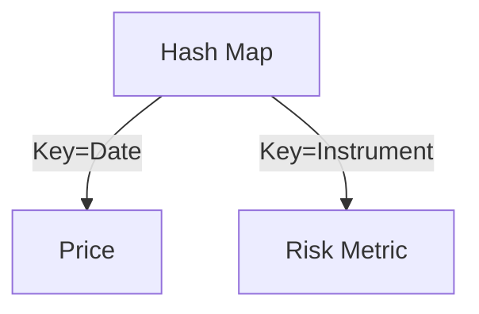
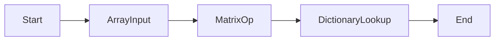

````markdown
# Essential Data Structures for Quants

Quantitative finance (quant) relies heavily on the right data structures to efficiently store, process, and analyze financial time series, portfolios, and models. Mastery of these structures is fundamental for strategy development and execution.

---

## Arrays and Vectors

* **Use:** Store sequential data like returns, prices, or signals.
* **Examples:** Python `list`, NumPy `array`, C++ `vector`.
* **Visualization:** Often used for time series in backtesting.

```mermaid
graph TD
    Price1 --> Price2 --> Price3 --> PriceN
````

-----

## Matrices

  * **Use:** Store multidimensional data (e.g., price history of multiple assets, covariance matrices).
  * **Examples:** NumPy 2D arrays, pandas `DataFrame`s.
  * **Visualization:** Useful for portfolio optimization and risk modeling.

<!-- end list -->

```mermaid
graph LR
    Asset1["Asset 1 Prices"]
    Asset2["Asset 2 Prices"]
    Asset3["Asset 3 Prices"]
    Day1["Day 1"]
    Day2["Day 2"]
    Day3["Day 3"]

    Day1 --> Asset1
    Day1 --> Asset2
    Day1 --> Asset3

    Day2 --> Asset1
    Day2 --> Asset2
    Day2 --> Asset3

    Day3 --> Asset1
    Day3 --> Asset2
    Day3 --> Asset3
```

-----

## Hash Maps and Dictionaries

  * **Use:** Provide rapid access to data keyed by instrument, date, or risk factor.
  * **Examples:** Python `dict`, C++ `std::map`.
  * **Visualization:** Ideal for sparse datasets or irregular trading calendars.

<!-- end list -->



-----

## Specialized Financial Structures

  * **Bars:** Time bars, tick bars, volume bars, dollar bars—these are methods to aggregate price data for different market conditions and finer-grained analysis.

-----

## Visualizing Data Structures

  * **Array Visualization:** \![Array visualization sample]
  * **Matrix (Correlation Heatmap):** \![Matrix or heatmap illustration]
  * **More Visualizations:** For more Markdown visualizations and dashboard layouts, check out Omni Analytics’ examples and this R/Shiny/Flexdashboard walkthrough.

-----

## Interactive Diagrams and Animations

  * Create animated array and matrix transformations using GIFs (example on Giphy).
  * Embed interactive Plotly plots in HTML Markdown output (Plotly documentation).
  * **Flowchart Example:**

<!-- end list -->



-----

## Further Reading

  * [Markdown Guide for Data Visualization](https://www.markdownguide.org/getting-started/)
  * [Typora Diagram Syntax Examples](https://support.typora.io/Draw-Diagrams-With-Markdown/)
  * [Getting Started with Markdown](https://info474-s17.github.io/book/markdown.html)

-----

## References

  * [Omni Analytics](https://docs.omni.co/docs/visualization-and-dashboards/visualization-types/markdown/examples)
  * [PhilippPro GitHub](https://philipppro.github.io/data_visualisation/)
  * [GitHub Diagrams](https://docs.github.com/en/get-started/writing-on-github/working-with-advanced-formatting/creating-diagrams)
  * [Typora Docs](https://support.typora.io/Draw-Diagrams-With-Markdown/)
  * [INFO 474 Class Notes](https://info474-s17.github.io/book/markdown.html)
  * [Data Viz M20](https://datavizm20.classes.andrewheiss.com/resource/markdown/)
  * [Markdown Guide](https://www.markdownguide.org/getting-started/)

<!-- end list -->

```
```
